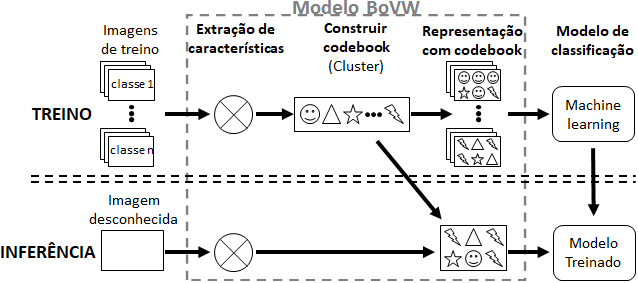

# Sobre
Codificação em python do método Bag of Visual Words para classificação de imagens de metal particulado, baseado no artigo de DeCost e Holm.

# Cite
Se este código lhe foi util de alguma forma, por favor, cite o seguinte artigo
```
Espaço para inserir a citação em ABNT
```

```
Espaço para inserir a citação em latex
```

# Bag Of Visual Words


# Base de dados
Utilizamos a base de dados Synthetic SEM Images of Powder Materials disponibilizada gratuitamente pelos autores. Se deseja utilizar a base de dados refira-se ao artigo original.

Artigo da base de dados: [A large dataset of synthetic SEM images of powder materials and their ground truth 3D structures
](https://www.sciencedirect.com/science/article/pii/S2352340916306382?via%3Dihub). 

# Licensa
Todo este repositório, incluindo códigos, notebooks, imagens, arquivos e etc. está sobre a licensa GPLv3.

# ToDo
- [ ] Adicionar explicação sobre o BoVW.
