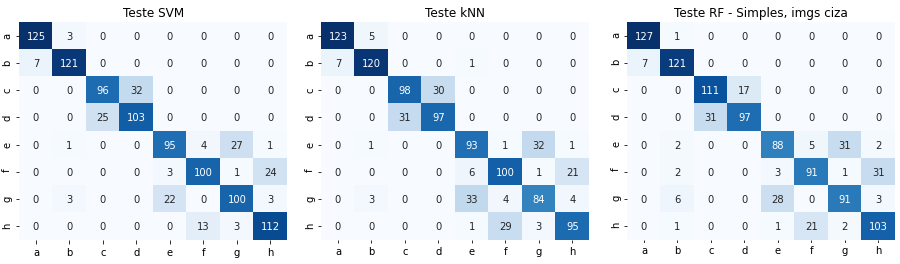

# Sobre
Codificação em python do método Bag of Visual Words para classificação de imagens de metal particulado, baseado no artigo de DeCost e Holm.

Os resultados podem ser vistos na matriz de confusão
> 

# Cite
Se parte do código ou das imagens deste repositório lhe foi util de alguma forma, por favor, cite o seguinte artigo
```
VALE, Juan Pablo do Nascimento; MACHADO, Christian Prado dos Santos; FILHO, ALEX OLIVEIRA BARRADAS. CARACTERIZAÇÃO DE METAL PARTICULADO USANDO BAG OF VISUAL WORDS.. In: Anais do Congresso Brasileiro Interdisciplinar em Ciência e Tecnologia. Anais...Diamantina(MG) Online, 2023. Disponível em: https//www.even3.com.br/anais/cobicet2023/627712-CARACTERIZACAO-DE-METAL-PARTICULADO-USANDO-BAG-OF-VISUAL-WORDS.
```

```
Após publicado, aqui estará a citação em formato BibTex
```

# Bag Of Visual Words (BoVW)
O BoVW é um método de extração de características composto, que consiste em usar um extrator mais simples (SIFT, ORB, SURF, LBP, ou outro a sua escolha) e um método de agrupamento (K-Mean, KNNClustering, ou outro). Cada características extraída é considerada uma "palavra visual" e o método de agrupamento é usado para gerar um "dicionário de palavras visuais".

> Esquema básico do BoVW
> 
> 
> 
> Fonte: [Link pro artigo publicado](ttps//www.even3.com.br/anais/cobicet2023/627712-CARACTERIZACAO-DE-METAL-PARTICULADO-USANDO-BAG-OF-VISUAL-WORDS). Baseado na imagem presente em [L. Fei-Fei; P. Perona](https://ieeexplore.ieee.org/document/1467486)

# Base de dados
Utilizamos a base de dados Synthetic SEM Images of Powder Materials disponibilizada gratuitamente pelos autores. Se deseja utilizar a base de dados refira-se ao artigo original.

Artigo da base de dados: [A large dataset of synthetic SEM images of powder materials and their ground truth 3D structures
](https://www.sciencedirect.com/science/article/pii/S2352340916306382?via%3Dihub). 

# Licensa
Todo este repositório, incluindo códigos, notebooks, imagens, arquivos e etc. está sobre a licensa GPLv3.
